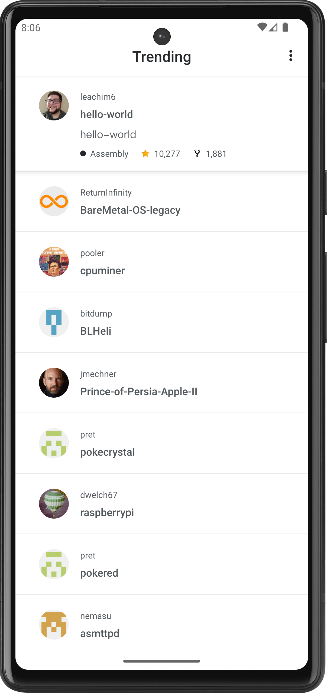

# GithubRepoApp

GithubRepoApp is an Android application that allows users to view a list of GitHub repositories along with their programming language, star and fork details, and the author's name. Additionally, it provides a sorting feature to arrange the repository list by name or star count.

## 🛠 Technologies

- CLEAN architecture
- MVVM architectural pattern
- Room database
- Dagger Hilt
- Retrofit
- Unit test

## Features

- Retrieve and display a list of GitHub repositories.
- Show repository details, including programming language, star count, and fork count.
- Sort the repository list by name or star count.
- Click on a repository to view more details on GitHub.

## 📸 Screenshots

Main             |        Sorting  
:-------------------------:|:-------------------------:
  |   

## 🤝🏻 Contribute

Any PRs are very welcome! 😍 You can fix a bug, add a feature, optimize performance and even propose a new cool approach in code-base architecture. Feel free and make a PR! 😌
